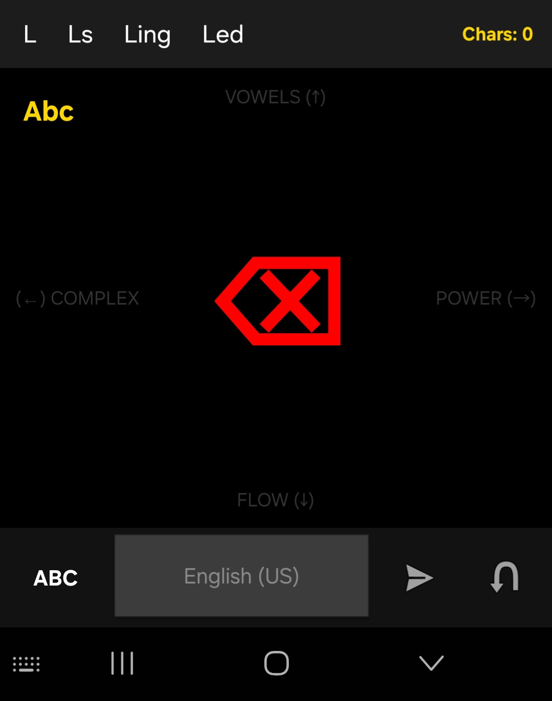
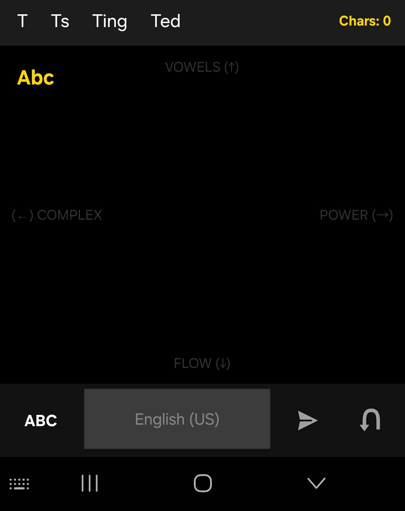

# El-Daniel-Keypad
**Precision and Clarity in Every Swipe.**

El-Daniel-Keypad is an Android IME (Input Method Editor) designed to replace the clutter of 30+ tiny buttons with 8 clear directional paths. Inspired by the clarity and excellence of Daniel, this keypad is built for seniors, high speed typists, and anyone seeking a more intentional way to communicate.

## 📸 Media Preview

## ✨ Key Features
- **Swift Daniel Logic:** Vowels (↑), Power Consonants (→), and Flow Consonants (↓) are just a swipe away.
- **Aggressive Swipe-to-Delete:** No more hunting for a backspace button; a long swipe left clears your path.
- **Two-Finger Tapdown Pivot:** Anchor direction with a 1-finger tapdown and tap with another finger to instantly execute actions across a full 360-degree directional space.
- **Send & Return:** Dedicated buttons for instant communication and line breaks.

### See the 360° Two-Finger Tapdown Pivot in Action:

## 📲 Mobile Download & Installation (No PC Required)

If you are on an Android device and want to test the keypad layout immediately without building from source, you can install our pre-compiled package directly:

1. **Download the App:** Click here to download the latest stable mobile file: [👉 Download El-Daniel Keypad APK (Latest Beta Version)](https://github.com/launchbypatrickwebdev-creator/El-Daniel-Easy-Stroke-Keypad/releases/tag/v1.0.0)
2. **Allow Installation:** When opening the downloaded file, your device might prompt you with a security warning regarding "Unknown Sources" or installing apps from your browser. 
   - *Go to your phone's Settings > Apps > Special App Access > Install Unknown Apps > Toggle "Allow from this source" for your Browser/Files app.*
3. **Activate the Input Method:** Once installed, open your Android System Settings, navigate to **Languages & Input > On-screen Keyboard / Manage Keyboards**, and switch the toggle switch to **ON** for **El-Daniel Keypad**.

## 🌍 The Mission & Open Contributions
We are actively expanding the core engine and looking for developers, designers, and language experts to collaborate with us! 

If you want to contribute, please dive straight into our active roadmap threads on the [GitHub Discussions](../../discussions) board:

* **🌐 Language Localization:** Help us map and optimize the **4 absolute directions** to natively support Spanish, Arabic, French, and more. Join the localization discussion thread.
* **♿ Accessibility Integration:** Help us improve and customize haptic feedback patterns to maximize typing clarity for users with visual impairments. Join the accessibility design thread.
* **🎮 Custom Gaming Strokes:** Share your configuration scripts, layout maps, and multi-touch combo ideas for mobile gaming before we drop the dedicated controller layout.

## ⚖️ Licensing, Attribution & Sustenance Rules

This project is open-source under the terms of the **GNU General Public License v3 (GPL v3)**. By using, modifying, or distributing this software, you are bound by the following structural conditions:

### 1. Mandatory Source Attribution (No Content Theft)
You are permitted to modify this codebase, but you **CANNOT** distribute or publish any modified version on any platform (GitHub, Google Play Store, specialized gaming forums, etc.) without prominent, explicit reference to the original source. 
* Any derivative work must state clearly at the top of the documentation and in the app's "About/Settings" section: 
  **"Based on the original El Daniel Keypad architecture by EchoLevel Sentinel LTD (LaunchByPatrick)."**
* You must include a functioning, clickable hyperlink back to this original repository.

### 2. The Sustenance Covenant (Mandatory Support Routing)
To keep the core engine maintained and moving forward, any developer or entity that distributes a modified version of this software **must maintain a direct, visible link** in their configuration layout prompting users to support the original creator. 
* You cannot strip out the original "Support the Mission" pathway. 
* Modified distributions must explicitly state to their user base that financial sustenance tokens, donations, or project support should be routed directly to the original innovation ecosystem via:
  👉 [Support the Project Infrastructure & Mission](https://paystack.shop/pay/launchbypatrick_mission)

### 3. Commercial Gate (Prohibited Monetization)
* **Hobbyists & Gamers:** You are free to modify and share your custom gaming stroke variations for free, provided you follow the attribution and sustenance rules above.
* **Commercial Entities & Platforms:** You are strictly forbidden from selling, renting, or charging for this code or any derivative of it or using this code in a commercial environment for profit. If a manufacturer, OEM, or third-party platform wishes to sell a product utilizing this directional-flow logic, you **must** purchase a separate Commercial License.

For commercial licensing clearances, institutional partnerships, or to buy out the open-source restriction, route your queries here:
👉 [Secure a Commercial License / Support the Mission](https://paystack.shop/pay/launchbypatrick_mission)
📩 **Official Contact Email:** [Launchbypatrick.webdev@gmail.com]
